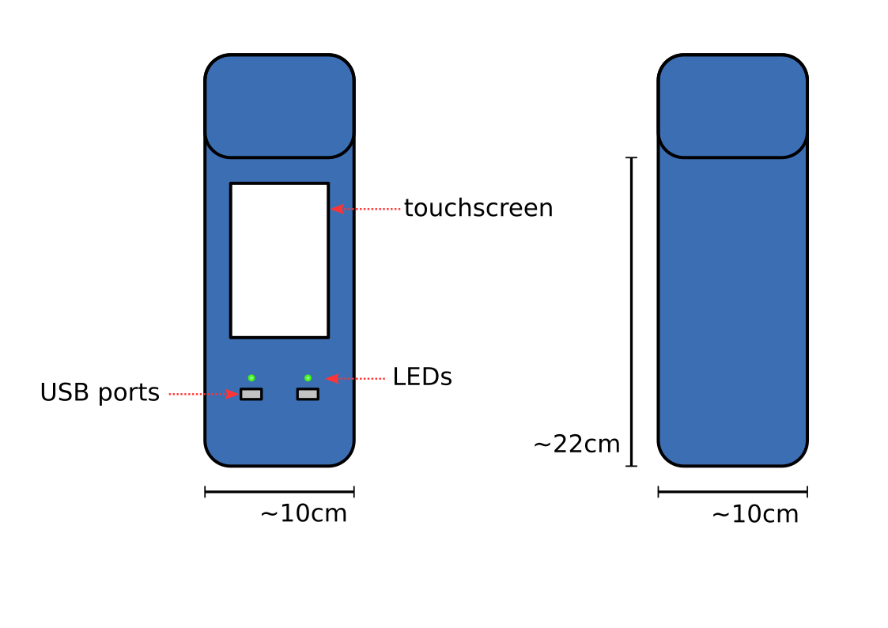

Fedorator
===

This is a repo containing source files for the Fedorator.

The Fedorator is a device for writing a live image of
[Fedora](http://fedoraproject.org/), the Linux distribution, onto a USB
flash drive.

Concept
---

This concept is a moderately large device which is to be fixed in place and used while standing.  It features a promiment touchscreen LCD positioned vertically.  The screen provides a simple menu interface as well as information on the status and progress.  There are two USB slots present, each with a corresponding status light.  In order to be stable, the device needs support from the back.
            
Due to the need to drive a powerful LCD and the number of USB ports, putting a Raspberry Pi computer at the core makes the most sense.
            
In order not to have stability issues, a heavy weight will likely be necessary to keep the Fedorator in place as it's being used.
            
The Fedorator needs to be plugged into a power source, so there will be a cable running from the back.
